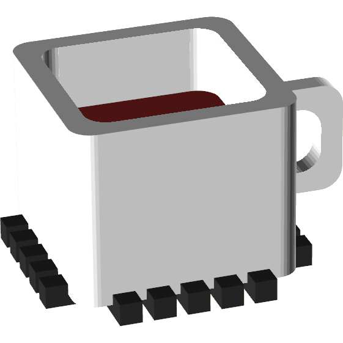

<p align="center">
    
</p>

<h1 align="center">Stacklyn</h1>

<p align="center">
  Turn JavaScript stack traces into structured data.
  <br>
  <i>Supports V8, SpiderMonkey, JavaScriptCore, Carakan, Internet Explorer, and more.</i>
</p>

<p align="center"><code>npm install stacklyn</code></p>

<p align="center">
    
    
    
</p>

---

## Getting Started

Live demo is at https://stacklynjs.github.io/demo.

First and foremost, `npm install stacklyn`.  
*(and/or use one of the direct import methods listed below)*  

Here's some example usage code so you don't feel lost while I finish writing the docs:

```js
import Stacklyn from "stacklyn";

try {
    // some risky code here that might throw an error
} catch (error) {
    // array of objects
    const parsed = Stacklyn.parse(error);

    // still an array of objects, but with source map info
    const mapped = Stacklyn.map(parsed);

    mapped.forEach(frame => console.log(frame.raw)); // log the sourcemapped stack frames
}
```

### What we offer:
- **Stacktrace Parsing:** Convert raw and hard to read stack strings into clean, structured data.
- **Stacktrace Stringification:** Turn a parsed stack back into a string.
- **Stacktrace Conversion:** Transform stack traces between different formats.
- **Structured CallSite Info:** Directly work with static data gathered from V8 `CallSite` objects.
- **Source Map Integration:** Map minified or transpiled stack frames back to their original source files and lines for accurate debugging.
- **Context Enrichment:** Add valuable surrounding code context to each stack frame for deeper insights.
- **Error Serialization:** Make error properties enumerable for easier serialization and logging.

And best of all, supports most stack trace formats you'll come across!

<sub>*Stacklyn V2 will add even more cool stuff! See the [roadmap](#roadmap) to know more.*</sub>

### Supported Formats
- &nbsp; Chrome 3+ (V8)
- &nbsp; Node.js (V8)
- &nbsp; Electron (V8)
- &nbsp; Deno (V8)
- &nbsp; Firefox 1+ (SpiderMonkey)
- &nbsp; Safari 6+ (JSC)
- &nbsp; Bun (V8-JSC Hybrid)
- &nbsp; IE 10+ (ChakraCore)
- &nbsp; Edge Legacy (ChakraCore)
- &nbsp; Opera \<15 (Linear B, Futhark, Carakan)
- &nbsp; Netscape 7+ (Mocha / SpiderMonkey)
- &nbsp; Espruino (not kidding)

> [!NOTE]  
> > "Why do the logos look old?"
>  
> They show the *first* version that added stack trace support.  
> However, all versions after the ones marked with a + are supported too.

##  Import Stacklyn
Stacklyn supports all kinds of imports!
1. As an HTML script tag:  
  <sub>*(note: Stacklyn is automatically placed as `window.Stacklyn` or `globalThis.Stacklyn` in the global scope if you do this)*</sub>
    ```html
    <script src="https://cdn.jsdelivr.net/npm/stacklyn/stacklyn.js"><script>
    ```
   
1. For use in JavaScript code directly:
    ```js
    // 1. ES Modules
    import Stacklyn from 'stacklyn';
    
    // 2. CommonJS (Node only)
    const Stacklyn = require('stacklyn');
    
    // 3. RequireJS
    require(["stacklyn"], function(Stacklyn){
        // Your usage code here
    });
  
    // 4. Web Workers
    importScripts("https://cdn.jsdelivr.net/npm/stacklyn/stacklyn.js");

    // You can also refer to Stacklyn once imported as:
    Stacklyn; // Direct (works regardless of how you imported)
    window.Stacklyn; // Browsers
    globalThis.Stacklyn; // Modern JS runtimes (2020+)
    self.Stacklyn; // Web workers
    global.Stacklyn; // Node.js
    // And then use the methods as usual, for example: window.Stacklyn.parse(myError);
    ```
    
Note that with the way stacklyn is made, it works no matter what JS env you're running! 

This means even in CSP'd environments (e.g. file://), you can still parse stack traces :D  
<sub>*(you cannot fetch local file information, best to use localhost for that)*</sub>

---
## Roadmap
- Docs: In progress

### V2 Roadmap
- Extension System (`Stacklyn.createExtension`)
- More Stack Formats (Jsish, Boa)
  - Graal.js, Hermes, JS-Interpreter, Duktape, XS, NJS, QuickJS, and LibJS will be added to `parseV8` as an `environment` if statement.
- Parse Bluebird extended stack traces
- `overwrite` method to change the default runtime stack format, accepts a callback function
---

##  Contributing
We welcome contributors!
If you've found a bug, had a suggestion, etc. Feel free to submit an issue or PR!

# License
Stacklyn is licensed under the Apache-2.0 License, the full text is at [`LICENSE`](/LICENSE) and a portion is located under every file.